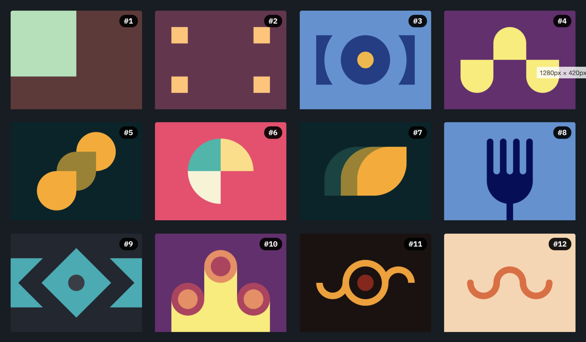
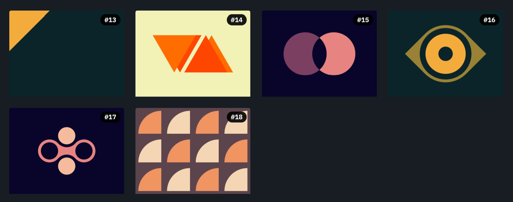
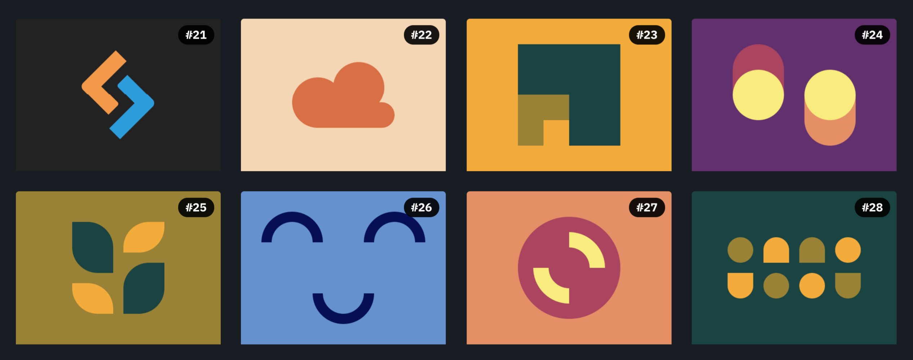
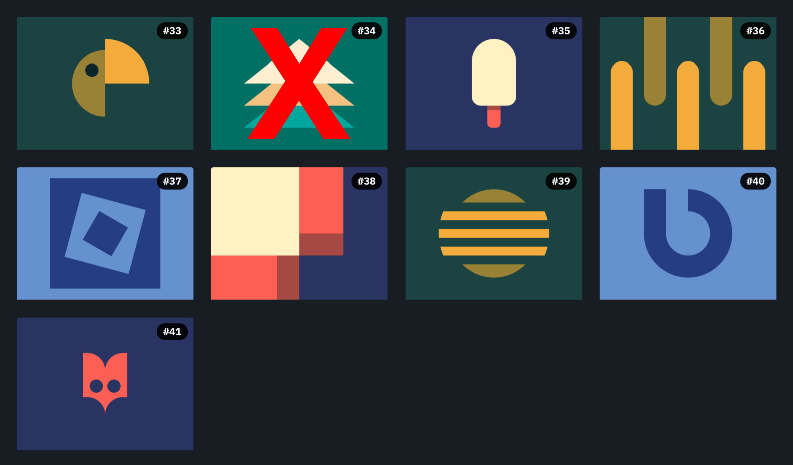

# CSS Battle

Let's design with code! 

Here is my solutions for some problems on cssbattle.dev. Maybe this is not the best solution, but it's work!

Some problems may be skipped for some reason.

## Scoring

I make this solutions for better understanding and readability. So, if you want to get a higher score, you need to change the class name with a minimal character.

## Battle #1 - Pilot Battle

- [#1 - Simply Square](./solutions/1-pilot-battle/1-simply-square.md)
- [#2 - Carrom](./solutions/1-pilot-battle/2-carrom.md)
- [#3 - Push Button](./solutions/1-pilot-battle/3-push-button.md)
- [#4 - Ups n Downs](./solutions/1-pilot-battle/4-ups-n-downs.md)
- [#5 - Acid Rain](./solutions/1-pilot-battle/5-acid-rain.md)
- [#6 - Missing Slice](./solutions/1-pilot-battle/6-missing-slice.md)
- [#7 - Leafy Trail](./solutions/1-pilot-battle/7-leafy-trail.md)
- [#8 - Forking Crazy](./solutions/1-pilot-battle/8-forking-crazy.md)
- [#9 - Tesseract](./solutions/1-pilot-battle/9-tesseract.md)
- [#10 - Cloaked Spirits](./solutions/1-pilot-battle/10-cloaked-spirits.md)
- [#11 - Eye of Sauron](./solutions/1-pilot-battle/11-eye-of-sauron.md)
- [#12 - Wiggly Moustache](./solutions/1-pilot-battle/12-wiggly-moustache.md)

## Battle #2 - Visibility

- [#13 - Totally Triangle](./solutions/2-visibility/13-totally-triangle.md)
- [#14 - Web Maker Logo](./solutions/2-visibility/14-web-maker-logo.md)
- [#15 - Overlap](./solutions/2-visibility/15-overlap.md)
- [#16 - Eye of The Tiger](./solutions/2-visibility/16-eye-of-the-tiger.md)
- [#17 - Fidget Spinner](./solutions/2-visibility/17-fidget-spinner.md)
- [#18 - Matrix](./solutions/2-visibility/18-matrix.md)

## Battle #3 - Cursor

- [#19 - Cube](./solutions/3-cursor/19-cube.md)
- [#20 - Ticket](./solutions/3-cursor/20-ticket.md)

## Battle #4 - Display

- [#21 - SitePoint Logo](./solutions/4-display/21-sitepoint-logo.md)
- [#22 - Cloud](./solutions/4-display/22-cloud.md)
- [#23 - Boxception](./solutions/4-display/23-boxception.md)
- [#24 - Switches](./solutions/4-display/24-switches.md)
- [#25 - Blossom](./solutions/4-display/25-blossom.md)
- [#26 - Smiley](./solutions/4-display/26-smiley.md)
- [#27 - Lock Up](./solutions/4-display/27-lock-up.md)
- [#28 - Cups & Balls](./solutions/4-display/28-cups-&-balls.md)

## Battle #5 - Inline

- [#29 - Suffocate](./solutions/5-inline/29-suffocate.md)
- [#30 - Horizon](./solutions/5-inline/30-horizon.md)

## Battle #6 - Conic

- [#31 - Equals](./solutions/6-conic/31-equals.md)
- [#32 - Band-aid](./solutions/6-conic/32-band-aid.md)

## Battle #7 - Backface

- [#33 - Birdie](./solutions/7-backface/33-birdie.md)
- #34 - Christmas Tree (Skipped)
- [#35 - Ice Cream](./solutions/7-backface/35-ice-cream.md)
- [#36 - Interleaved](./solutions/7-backface/36-interleaved.md)
- [#37 - Tunnel](./solutions/7-backface/37-tunnel.md)
- [#38 - Not Simply Square](./solutions/7-backface/38-not-simply-square.md)
- [#39 - Sunset](./solutions/7-backface/39-sunset.md)
- [#40 - Letter B](./solutions/7-backface/40-letter-b.md)
- [#41 - Fox Head](./solutions/7-backface/41-fox-head.md)

## Battle #8 - Transition

- #42 - Baby (Skipped)
- [#43 - Wrench](./solutions/8-transition/43-wrench.md)
- [#44 - Stripes](./solutions/8-transition/44-stripes.md)

Wait for other solutions...