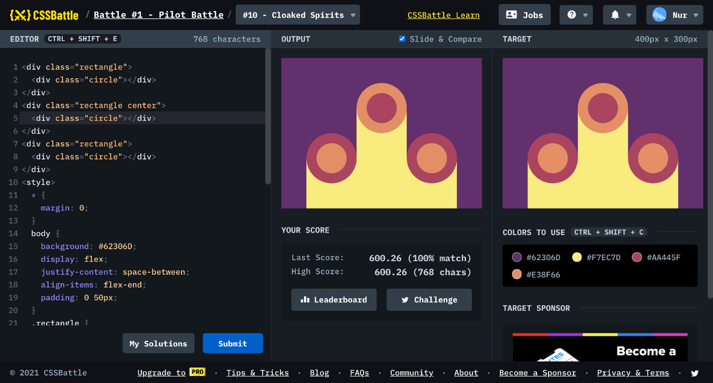

# Battle #1 - Pilot Battle

## #10 - Cloaked Spirits

[Link to the problem](https://cssbattle.dev/play/10)



```html
<div class="rectangle">
  <div class="circle"></div>
</div>
<div class="rectangle center">
  <div class="circle"></div>
</div>
<div class="rectangle">
  <div class="circle"></div>
</div>
<style>
  * {
    margin: 0;
  }
  body {
    background: #62306D;
    display: flex;
    justify-content: space-between;
    align-items: flex-end;
    padding: 0 50px;
  }
  .rectangle {
    background: #F7EC7D;
    width: calc(100% / 3);
    height: 100px;
  }
  .rectangle.center {
    height: 200px;
  }
  .circle {
    width: 100px;
    height: 100px;
    background: #E38F66;
    border-radius: 50%;
   	border: 20px solid #AA445F;
    box-sizing: border-box;
    margin-top: -50px;
  }
  .center .circle {
    background: #AA445F;
    border-color: #E38F66;
  }
</style>
```