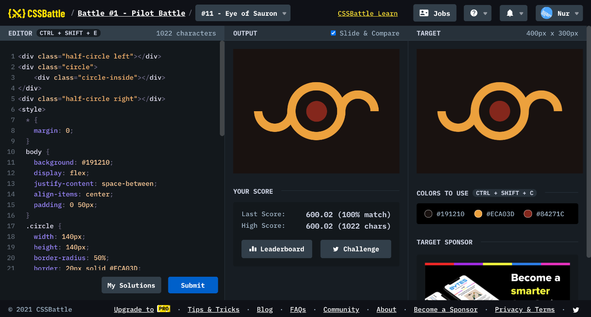

# Battle #1 - Pilot Battle

## #11 - Eye of Sauron

[Link to the problem](https://cssbattle.dev/play/11)



```html
<div class="half-circle left"></div>
<div class="circle">
	<div class="circle-inside"></div>
</div>
<div class="half-circle right"></div>
<style>
  * {
    margin: 0;
  }
  body {
    background: #191210;
    display: flex;
    justify-content: space-between;
    align-items: center;
    padding: 0 50px;
  }
  .circle {
    width: 140px;
    height: 140px;
    border-radius: 50%;
   	border: 20px solid #ECA03D;
    box-sizing: border-box;
    display: flex;
    justify-content: center;
    align-items: center;
  }
  .circle-inside {
    background: #84271C;
    width: 50px;
    height: 50px;
    border-radius: 50%;
  }
  .half-circle {
    width: 100px;
    height: 50px;
    box-sizing: border-box;
    border: 20px solid #ECA03D;
    border-top: 0;
    border-bottom-left-radius: 100px;
    border-bottom-right-radius: 100px;
  }
  .half-circle.left {
    margin-right: -20px;
    margin-top: 50px;
  }
  .half-circle.right {
    margin-left: -20px;
    margin-top: -50px;
    transform: scaleY(-1);
  }
</style>
```