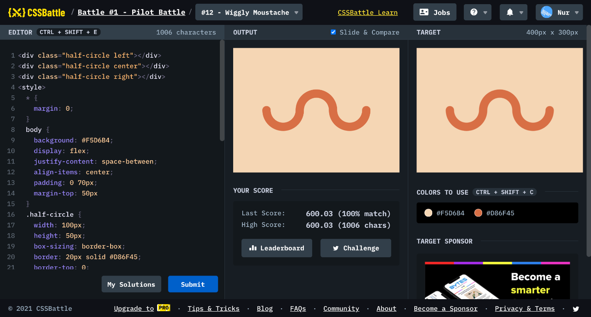

# Battle #1 - Pilot Battle

## #12 - Wiggly Moustache

[Link to the problem](https://cssbattle.dev/play/12)



```html
<div class="half-circle left"></div>
<div class="half-circle center"></div>
<div class="half-circle right"></div>
<style>
  * {
    margin: 0;
  }
  body {
    background: #F5D6B4;
    display: flex;
    justify-content: space-between;
    align-items: center;
    padding: 0 70px;
    margin-top: 50px
  }
  .half-circle {
    width: 100px;
    height: 50px;
    box-sizing: border-box;
    border: 20px solid #D86F45;
    border-top: 0;
    border-bottom-left-radius: 100px;
    border-bottom-right-radius: 100px;
    position: relative;
  }
  .half-circle.center {
    transform: scaleY(-1);
    margin: 0 -20px 100px -20px;
  }
  .half-circle.left::after,
  .half-circle.right::after {
    content: '';
    width: 20px;
    height: 10px;
    background: #D86F45;
    position: absolute;
    border-top-left-radius: 10px;
    border-top-right-radius: 10px;
  }
  .half-circle.left::after {
    top: -10px;
    left: -20px;
  }
  .half-circle.right::after {
    top: -10px;
    right: -20px;
  }
</style>
```