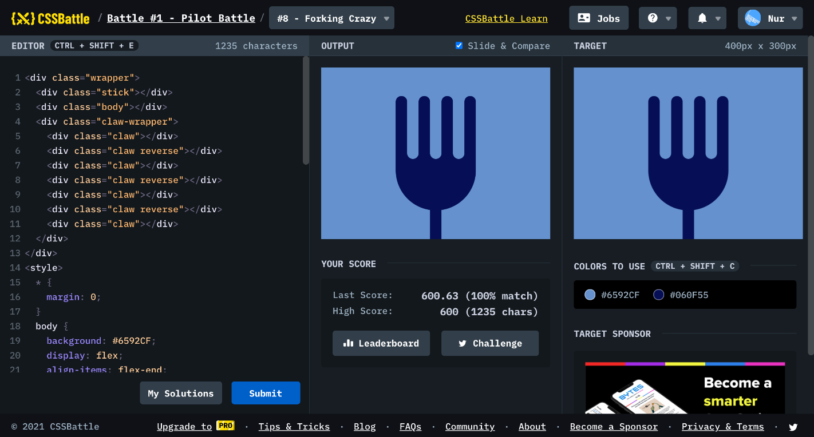

# Battle #1 - Pilot Battle

## #8 - Forking Crazy

[Link to the problem](https://cssbattle.dev/play/8)



```html
<div class="wrapper">
  <div class="stick"></div>
  <div class="body"></div>
  <div class="claw-wrapper">
    <div class="claw"></div>
    <div class="claw reverse"></div>
    <div class="claw"></div>
    <div class="claw reverse"></div>
    <div class="claw"></div>
    <div class="claw reverse"></div>
    <div class="claw"></div>
  </div>
</div>
<style>
  * {
    margin: 0;
  }
  body {
    background: #6592CF;
    display: flex;
    align-items: flex-end;
    justify-content: center;
  }
  .wrapper {
    width: 140px;
    height: 250px;
    position: relative;
  }
  div:not(.wrapper):not(.claw-wrapper) {
    background: #060F55;
  }
  .stick {
    width: 20px;
    height: 60px;
    position: absolute;
    bottom: 0;
    left: calc(50% - 10px);
  }
  .body {
    width: 140px;
    height: 100px;
    position: absolute;
    bottom: 50px;
    border-bottom-left-radius: 80px;
    border-bottom-right-radius: 80px;
  }
  .claw-wrapper {
    width: 140px;
    height: 110px;
    display: flex;
    justify-content: space-between;
  }
  .claw {
    width: 20px;
    border-top-left-radius: 20px;
    border-top-right-radius: 20px;
  }
  .claw.reverse {
    transform: scaleY(-1);
    background: #6592CF !important;
  }
</style>
```