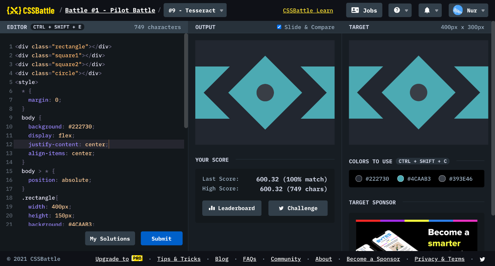

# Battle #1 - Pilot Battle

## #9 - Tesseract

[Link to the problem](https://cssbattle.dev/play/9)



```html
<div class="rectangle"></div>
<div class="square1"></div>
<div class="square2"></div>
<div class="circle"></div>
<style>
  * {
    margin: 0;
  }
  body {
    background: #222730;
    display: flex;
    justify-content: center;
    align-items: center;
  }
  body > * {
    position: absolute;
  }
  .rectangle{
    width: 400px;
    height: 150px;
    background: #4CAAB3;
    margin-top: 0px;
  }
  .square1 {
    width: 250px;
    height: 250px;
    background: #222730;
    transform: rotate(45deg);
  }
  .square2 {
    width: 150px;
    height: 150px;
    background: #4CAAB3;
    transform: rotate(45deg);
  }
  .circle {
    width: 50px;
    height: 50px;
    border-radius: 50%;
    background: #393E46;
  }
</style>
```