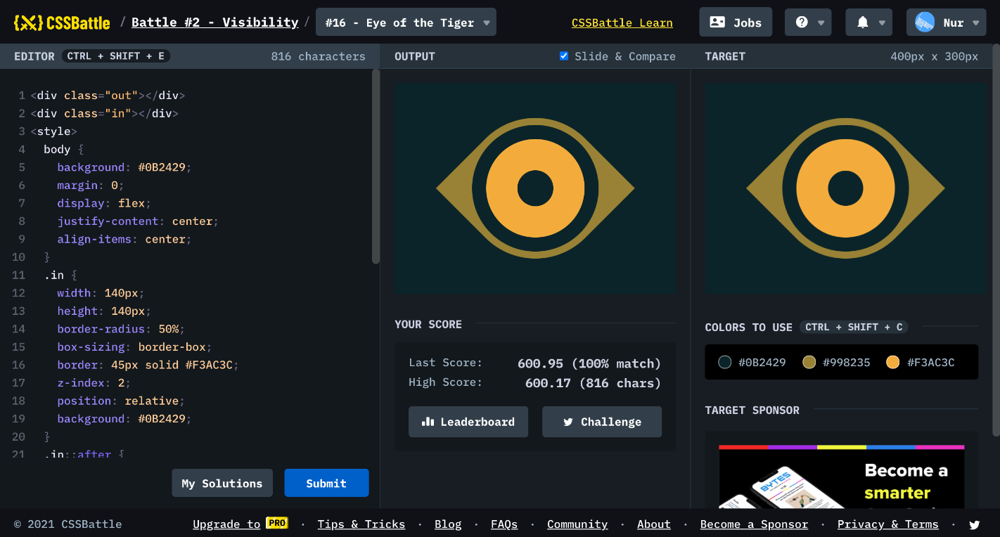

# Battle #2 - Visibility

## #16 - Eye of The Tiger

[Link to the problem](https://cssbattle.dev/play/16)



```html
<div class="out"></div>
<div class="in"></div>
<style>
  body {
    background: #0B2429;
    margin: 0;
    display: flex;
    justify-content: center;
    align-items: center;
  }
  .in {
    width: 140px;
    height: 140px;
    border-radius: 50%;
    box-sizing: border-box;
    border: 45px solid #F3AC3C;
    z-index: 2;
    position: relative;
    background: #0B2429;
  }
  .in::after {
    position: absolute;
    content: '';
    width: 180px;
    height: 180px;
    border-radius: 50%;
    box-sizing: border-box;
    border: 20px solid #0B2429;
    left: -65px;
    top: -65px;
  }
  .out {
    width: 200px;
    height: 200px;
    position: absolute;
    background: #998235;
    transform: rotate(45deg);
    border-top-left-radius: 50%;
    border-bottom-right-radius: 50%;
    z-index: 1;
  }
</style>
```