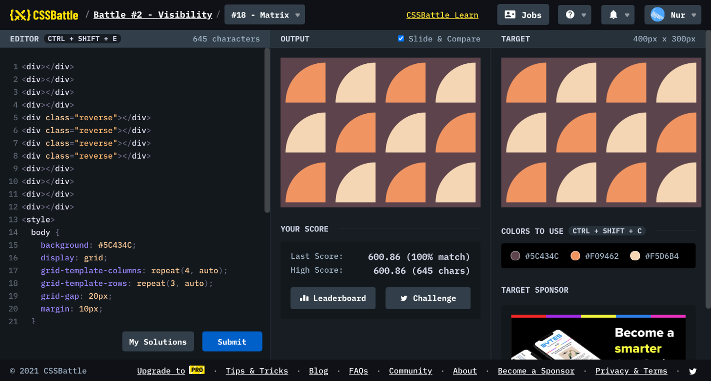

# Battle #2 - Visibility

## #18 - Matrix

[Link to the problem](https://cssbattle.dev/play/18)



```html
<div></div>
<div></div>
<div></div>
<div></div>
<div class="reverse"></div>
<div class="reverse"></div>
<div class="reverse"></div>
<div class="reverse"></div>
<div></div>
<div></div>
<div></div>
<div></div>
<style>
  body {
    background: #5C434C;
    display: grid;
    grid-template-columns: repeat(4, auto);
    grid-template-rows: repeat(3, auto);
    grid-gap: 20px;
    margin: 10px;
  }
  div {
    width: 80px;
    height: 80px;
    border-top-left-radius: 100%;
  }
  div:nth-child(odd),
  .reverse:nth-child(even) {
    background: #F09462;
  }
  div:nth-child(even),
  .reverse:nth-child(odd) {
    background: #F5D6B4;
  }
</style>
```