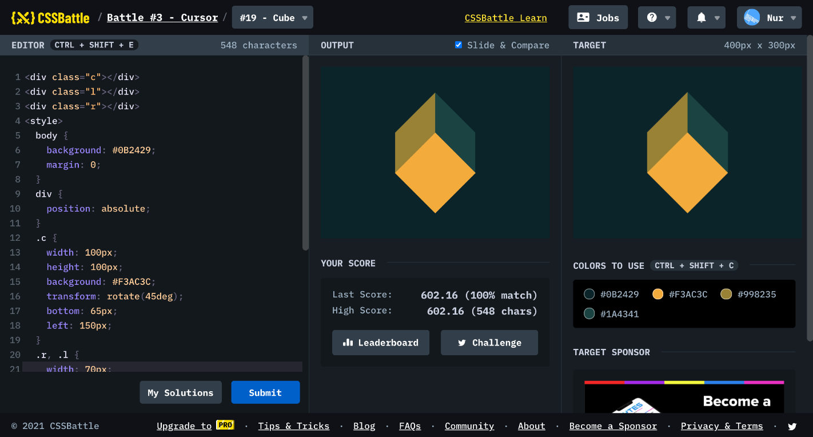

# Battle #3 - Cursor

## #19 - Cube

[Link to the problem](https://cssbattle.dev/play/19)



```html
<div class="c"></div>
<div class="l"></div>
<div class="r"></div>
<style>
  body {
    background: #0B2429;
    margin: 0;
  }
  div {
  	position: absolute;
  }
  .c {
    width: 100px;
    height: 100px;
    background: #F3AC3C;
    transform: rotate(45deg);
    bottom: 65px;
    left: 150px;
  }
  .r, .l {
    width: 70px;
    height: 70px;
    background: #1A4341;
    left: 200px;
    bottom: 150px;
    transform: skewY(45deg);
  }
  .l {
    background: #998235;
    transform: skewY(-45deg);
    left: auto;
    right: 200px;
  }
</style>
```