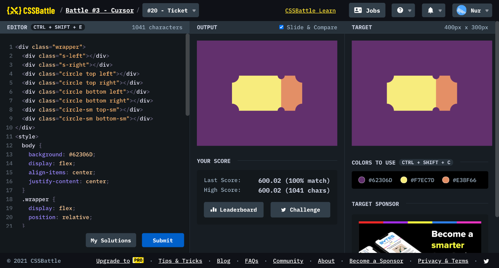

# Battle #3 - Cursor

## #20 - Ticket

[Link to the problem](https://cssbattle.dev/play/20)



```html
<div class="wrapper">
  <div class="s-left"></div>
  <div class="s-right"></div>
  <div class="circle top left"></div>
  <div class="circle top right"></div>
  <div class="circle bottom left"></div>
  <div class="circle bottom right"></div>
  <div class="circle-sm top-sm"></div>
  <div class="circle-sm bottom-sm"></div>
</div>
<style>
  body {
    background: #62306D;
    display: flex;
    align-items: center;
    justify-content: center;
  }
  .wrapper {
    display: flex;
    position: relative;
  }
  .s-left {
    width: 140px;
    height: 100px;
    background: #F7EC7D;
  }
  .s-right {
    width: 60px;
    height: 100px;
    background: #E38F66;
  }
  .circle, .circle-sm {
    width: 40px;
    height: 40px;
    border-radius: 50%;
    background: #62306D;
    position: absolute;
  }
  .circle-sm {
    width: 20px;
    height: 20px;
    right: 50px;
  }
  .left { left: -20px; }
  .top { top: -20px; }
  .right { right: -20px; }
  .bottom { bottom: -20px; }
  .top-sm { top: -10px; }
  .bottom-sm { bottom: -10px; }
</style>
```