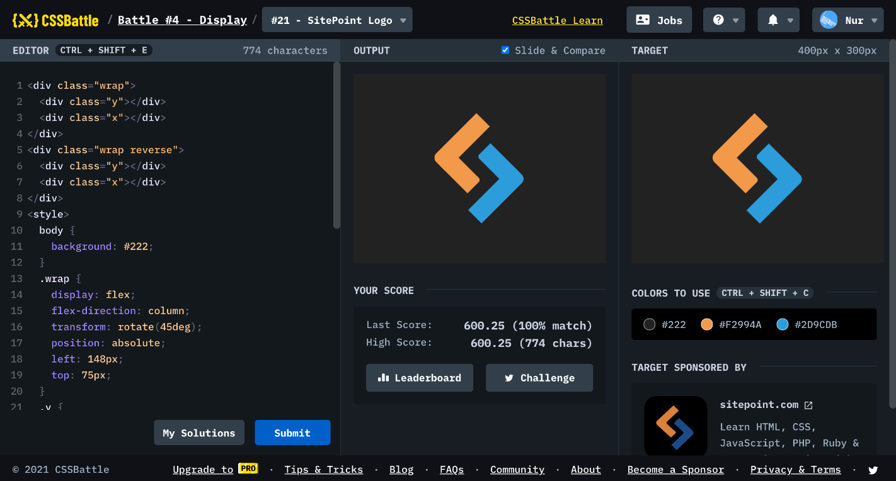

# Battle #4 - Display

## #21 - SitePoint Logo

[Link to the problem](https://cssbattle.dev/play/21)



```html
<div class="wrap">
  <div class="y"></div>
  <div class="x"></div>
</div>
<div class="wrap reverse">
  <div class="y"></div>
  <div class="x"></div>
</div>
<style>
  body {
    background: #222;
  }
  .wrap {
    display: flex;
    flex-direction: column;
    transform: rotate(45deg);
    position: absolute;
    left: 148px;
    top: 75px;
  }
  .y {
    width: 30px;
    height: 100px;
    background: #F2994A;
    border-bottom-left-radius: 10px;
  }
  .x {
    width: 60px;
    height: 30px;
    background: #F2994A;
    border-top-right-radius: 5px;
    margin-top: -30px;
    margin-left: 20px;
  }
  .wrap.reverse {
    transform: scale(-1, -1) rotate(45deg);
    top: 123px;
    left: 170px;
  }
  .reverse .y, 
  .reverse .x {
    background: #2D9CDB;
  }
</style>
```