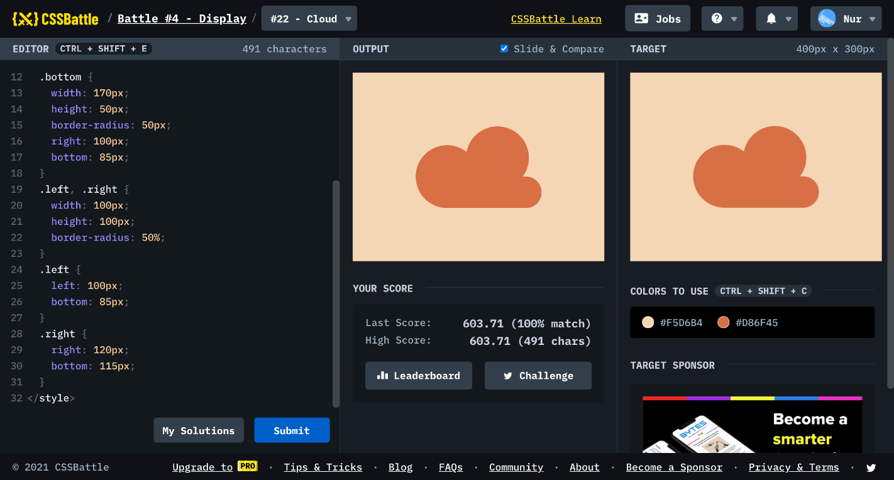

# Battle #4 - Display

## #22 - Cloud

[Link to the problem](https://cssbattle.dev/play/22)



```html
<div class="left"></div>
<div class="right"></div>
<div class="bottom"></div>
<style>
  body {
    background: #F5D6B4;
  }
  div { 
    position: absolute;
    background: #D86F45;
  }
  .bottom {
    width: 170px;
    height: 50px;
    border-radius: 50px;
    right: 100px;
    bottom: 85px;
  }
  .left, .right {
    width: 100px;
    height: 100px;
    border-radius: 50%;
  }
  .left {
    left: 100px;
    bottom: 85px;
  }
  .right {
    right: 120px;
    bottom: 115px;
  }
</style>
```