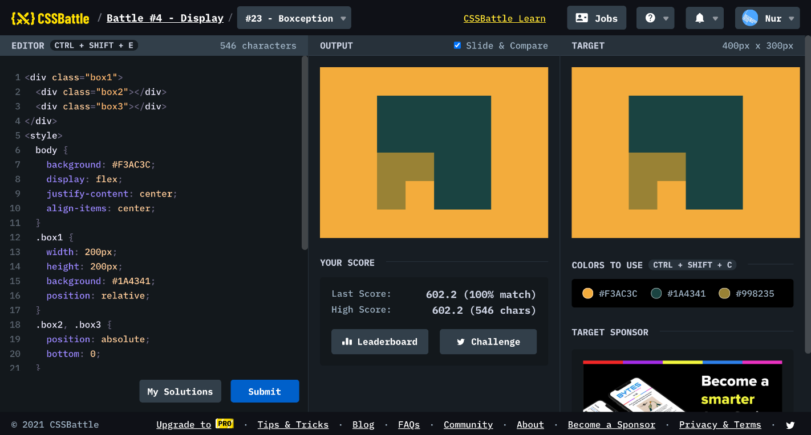

# Battle #4 - Display

## #23 - Boxception

[Link to the problem](https://cssbattle.dev/play/23)



```html
<div class="box1">
  <div class="box2"></div>
  <div class="box3"></div>
</div>
<style>
  body {
    background: #F3AC3C;
    display: flex;
    justify-content: center;
    align-items: center;
  }
  .box1 {
    width: 200px;
    height: 200px;
    background: #1A4341;
    position: relative;
  }
  .box2, .box3 {
    position: absolute;
    bottom: 0;
  }
  .box2 {
    background: #998235;
    width: 100px;
    height: 100px;
    left: 0;
  }
  .box3 {
    background: #F3AC3C;
    width: 50px;
    height: 50px;
    left: 50px;
  }
</style>
```