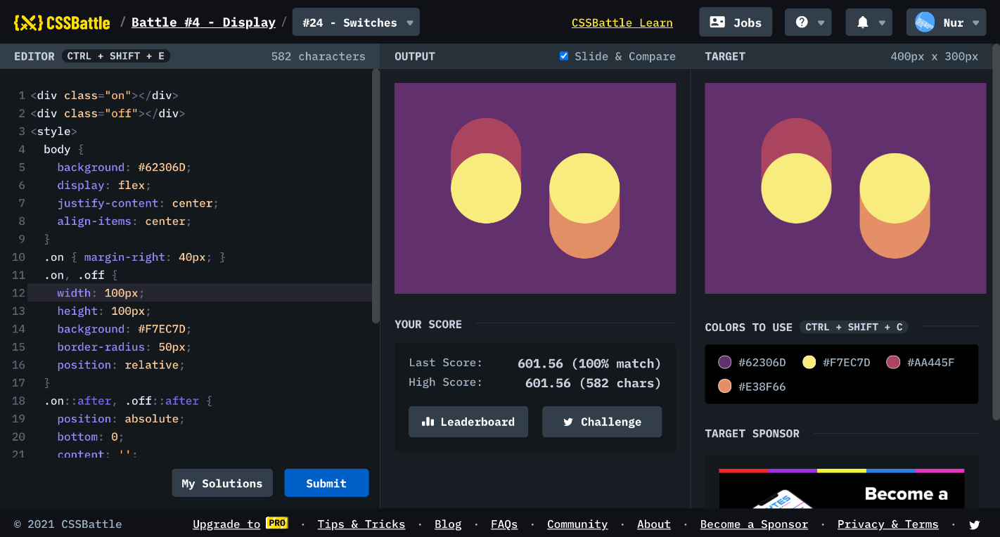

# Battle #4 - Display

## #24 - Switches

[Link to the problem](https://cssbattle.dev/play/24)



```html
<div class="on"></div>
<div class="off"></div>
<style>
  body {
    background: #62306D;
    display: flex;
    justify-content: center;
    align-items: center;
  }
  .on { margin-right: 40px; }
  .on, .off {
    width: 100px;
    height: 100px;
    background: #F7EC7D;
    border-radius: 50px;
    position: relative;
  }
  .on::after, .off::after {
    position: absolute;
    bottom: 0;
    content: '';
    width: 100px;
    height: 150px;
    background: #AA445F;
    border-radius: 50px;
    z-index: -1;
  }
  .off::after {
    top: 0;
    background: #E38F66;
  }
</style>
```