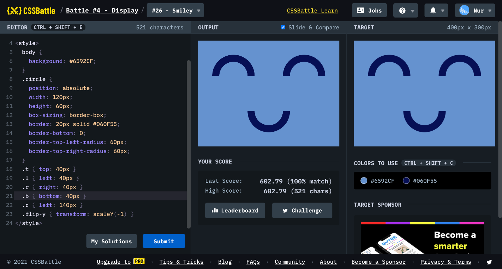

# Battle #4 - Display

## #26 - Smiley

[Link to the problem](https://cssbattle.dev/play/26)



```html
<div class="circle t l"></div>
<div class="circle t r"></div>
<div class="circle b c flip-y"></div>
<style>
  body {
    background: #6592CF;
  }
  .circle { 
    position: absolute;
    width: 120px;
    height: 60px;
    box-sizing: border-box;
    border: 20px solid #060F55;
    border-bottom: 0;
    border-top-left-radius: 60px;
    border-top-right-radius: 60px;
  }
  .t { top: 40px }
  .l { left: 40px }
  .r { right: 40px }
  .b { bottom: 40px }
  .c { left: 140px }
  .flip-y { transform: scaleY(-1) }
</style>
```