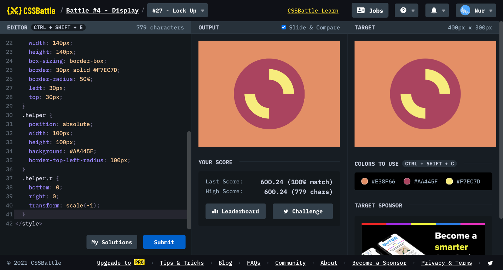

# Battle #4 - Display

## #27 - Lock Up

[Link to the problem](https://cssbattle.dev/play/27)



```html
<div class="circle">
  <div class="circle-in"></div>
  <div class="helper"></div>
  <div class="helper r"></div>
</div>
<style>
  body {
    background: #E38F66;
    display: flex;
    justify-content: center;
    align-items: center;
  }
  .circle { 
    width: 200px;
    height: 200px;
    border-radius: 50%;
    background: #AA445F;
    position: relative;
  }
  .circle-in {
    position: absolute;
    width: 140px;
    height: 140px;
    box-sizing: border-box;
    border: 30px solid #F7EC7D;
    border-radius: 50%;
    left: 30px;
    top: 30px;
  }
  .helper {
    position: absolute;
    width: 100px;
    height: 100px;
    background: #AA445F;
    border-top-left-radius: 100px;
  }
  .helper.r {
    bottom: 0;
    right: 0;
    transform: scale(-1);
  }
</style>
```