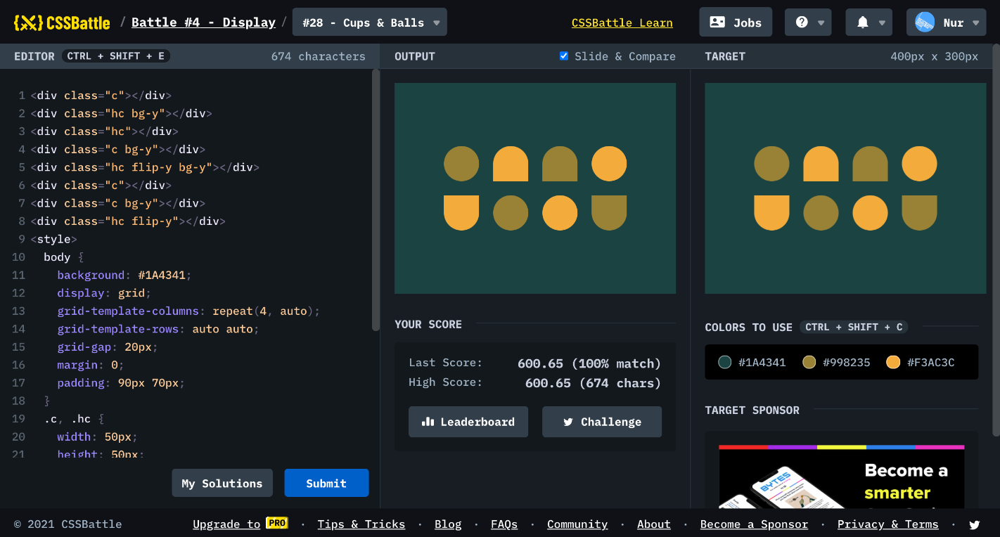

# Battle #4 - Display

## #28 - Cups & Balls

[Link to the problem](https://cssbattle.dev/play/28)



```html
<div class="c"></div>
<div class="hc bg-y"></div>
<div class="hc"></div>
<div class="c bg-y"></div>
<div class="hc flip-y bg-y"></div>
<div class="c"></div>
<div class="c bg-y"></div>
<div class="hc flip-y"></div>
<style>
  body {
    background: #1A4341;
    display: grid;
    grid-template-columns: repeat(4, auto);
    grid-template-rows: auto auto;
    grid-gap: 20px;
    margin: 0;
    padding: 90px 70px;
  }
  .c, .hc {
    width: 50px;
    height: 50px;
    background: #998235;
    border-radius: 50%;
  }
  .hc {
    border-bottom-left-radius: 0;
    border-bottom-right-radius: 0;
  }
  .bg-y { background: #F3AC3C }
  .flip-y { transform: scaleY(-1) }
</style>
```