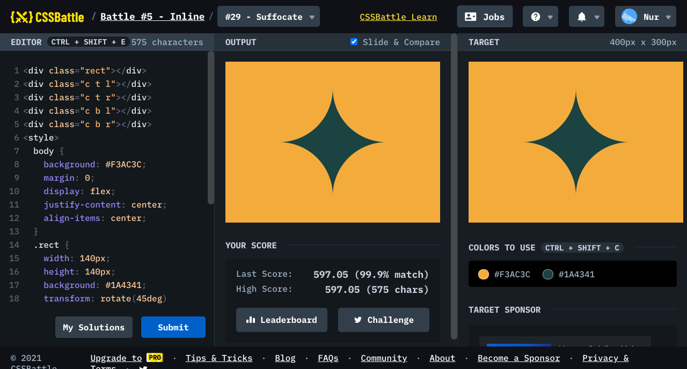

# Battle #5 - Inline

## #29 - Suffocate

[Link to the problem](https://cssbattle.dev/play/29)



```html
<div class="rect"></div>
<div class="c t l"></div>
<div class="c t r"></div>
<div class="c b l"></div>
<div class="c b r"></div>
<style>
  body {
    background: #F3AC3C;
    margin: 0;
    display: flex;
    justify-content: center;
    align-items: center;
  }
  .rect {
    width: 140px;
    height: 140px;
    background: #1A4341;
    transform: rotate(45deg)
  }
  .c {
    position: absolute;
    width: 200px;
    height: 200px;
    background: #F3AC3C;
    border-radius: 50%;
  }
  .t { top: -50px }
  .b { bottom: -50px }
  .r { right: 0 }
  .l { left: 0 }
</style>
```