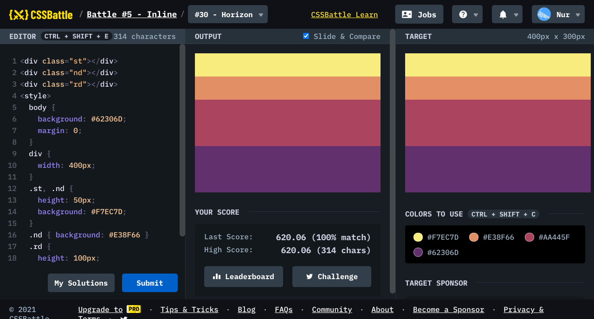

# Battle #5 - Inline

## #30 - Horizon

[Link to the problem](https://cssbattle.dev/play/30)



```html
<div class="st"></div>
<div class="nd"></div>
<div class="rd"></div>
<style>
  body {
    background: #62306D;
    margin: 0;
  }
  div {
    width: 400px;
  }
  .st, .nd {
    height: 50px;
    background: #F7EC7D;
  }
  .nd { background: #E38F66 }
  .rd {
    height: 100px;
    background: #AA445F;
  }
</style>
```