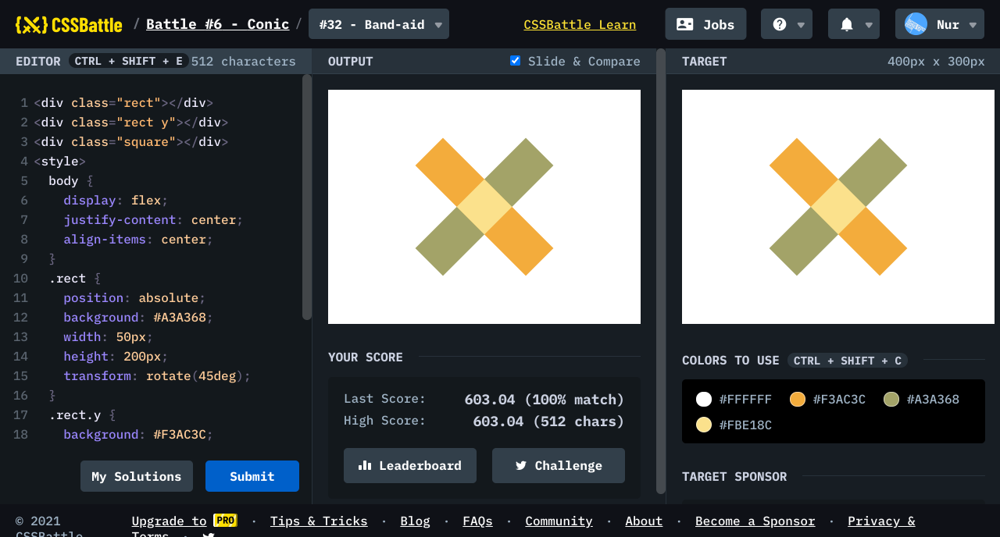

# Battle #6 - Conic

## #32 - Band-aid

[Link to the problem](https://cssbattle.dev/play/32)



```html
<div class="rect"></div>
<div class="rect y"></div>
<div class="square"></div>
<style>
  body {
    display: flex;
    justify-content: center;
    align-items: center;
  }
  .rect {
    position: absolute;
    background: #A3A368;
    width: 50px;
    height: 200px;
    transform: rotate(45deg);
  }
  .rect.y {
    background: #F3AC3C;
    transform: rotate(-45deg);
  }
  .square {
    position: absolute;
    width: 50px;
    height: 50px;
    background: #FBE18C;
    transform: rotate(45deg);
  }
</style>
```