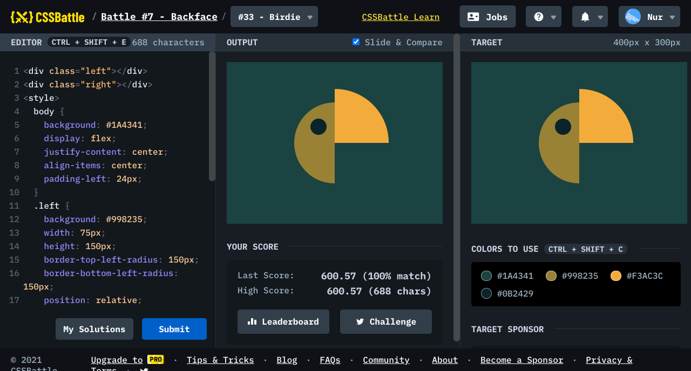

# Battle #7 - Backface

## #33 - Birdie

[Link to the problem](https://cssbattle.dev/play/33)



```html
<div class="left"></div>
<div class="right"></div>
<style>
  body {
    background: #1A4341;
    display: flex;
    justify-content: center;
    align-items: center;
    padding-left: 24px;
  }
  .left {
    background: #998235;
    width: 75px;
    height: 150px;
    border-top-left-radius: 150px;
    border-bottom-left-radius: 150px;
    position: relative;
  }
  .left::after {
    content: '';
    width: 30px;
    height: 30px;
    border-radius: 50%;
    background: #0B2429;
    position: absolute;
    left: 30px;
    top: 30px;
  }
  .right {
    margin-top: -100px;
    background: #F3AC3C;
    width: 100px;
    height: 100px;
    border-top-right-radius: 100px;
  }
</style>
```