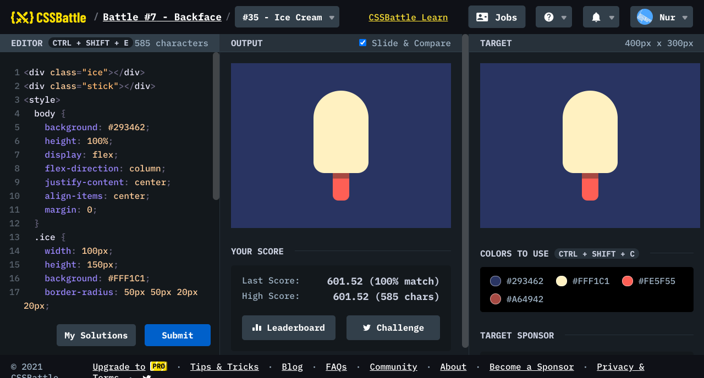

# Battle #7 - Backface

## #35 - Ice Cream

[Link to the problem](https://cssbattle.dev/play/35)



```html
<div class="ice"></div>
<div class="stick"></div>
<style>
  body {
    background: #293462;
    height: 100%;
    display: flex;
    flex-direction: column;
    justify-content: center;
    align-items: center;
    margin: 0;
  }
  .ice {
    width: 100px;
    height: 150px;
    background: #FFF1C1;
    border-radius: 50px 50px 20px 20px;
  }
  .stick {
    width: 30px;
    height: 50px;
    background: #FE5F55;
    border-radius: 0 0 10px 10px;
  }
  .stick::after {
    position: absolute;
    content: '';
    width: 30px;
    height: 10px;
    background: #A64942;
  }
</style>
```