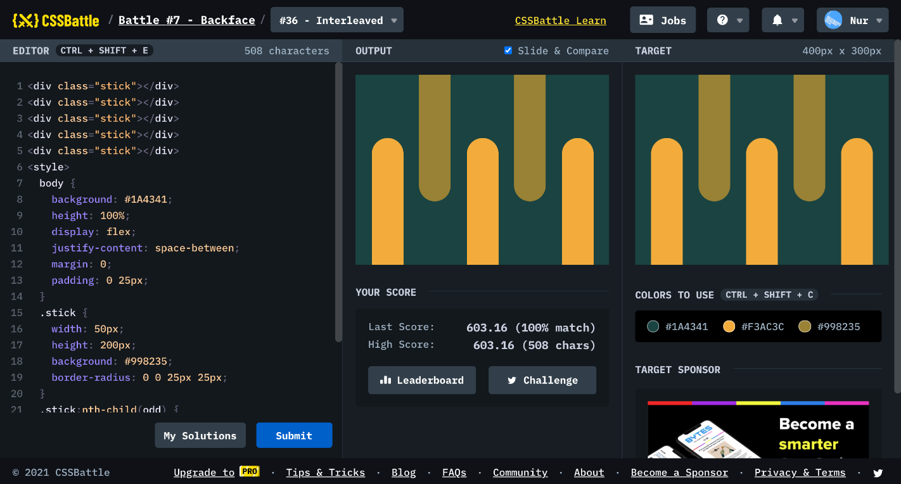

# Battle #7 - Backface

## #36 - Interleaved

[Link to the problem](https://cssbattle.dev/play/36)



```html
<div class="stick"></div>
<div class="stick"></div>
<div class="stick"></div>
<div class="stick"></div>
<div class="stick"></div>
<style>
  body {
    background: #1A4341;
    height: 100%;
    display: flex;
    justify-content: space-between;
    margin: 0;
    padding: 0 25px;
  }
  .stick {
    width: 50px;
    height: 200px;
    background: #998235;
    border-radius: 0 0 25px 25px;
  }
  .stick:nth-child(odd) {
    background: #F3AC3C;
    transform: scaleY(-1);
    margin-top: 100px;
  }
</style>
```