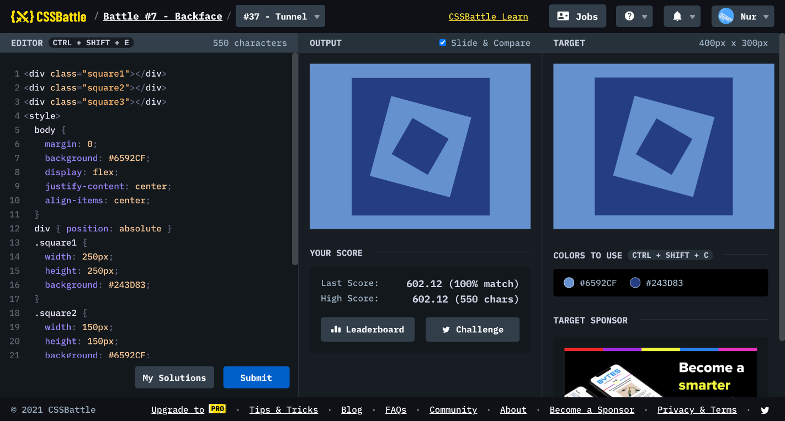

# Battle #7 - Backface

## #37 - Tunnel

[Link to the problem](https://cssbattle.dev/play/37)



```html
<div class="square1"></div>
<div class="square2"></div>
<div class="square3"></div>
<style>
  body {
    margin: 0;
    background: #6592CF;
    display: flex;
    justify-content: center;
    align-items: center;
  }
  div { position: absolute }
  .square1 {
    width: 250px;
    height: 250px;
    background: #243D83;
  }
  .square2 {
    width: 150px;
    height: 150px;
    background: #6592CF;
    transform: rotate(15deg);
  }
  .square3 {
    width: 75px;
    height: 75px;
    background: #243D83;
    transform: rotate(30deg);
  }
</style>
```