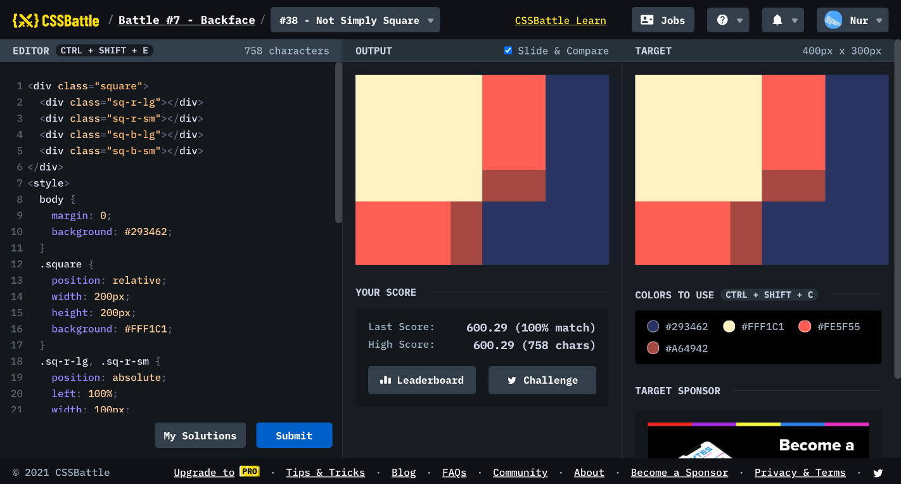

# Battle #7 - Backface

## #38 - Not Simple Square

[Link to the problem](https://cssbattle.dev/play/38)



```html
<div class="square">
  <div class="sq-r-lg"></div>
  <div class="sq-r-sm"></div>
  <div class="sq-b-lg"></div>
  <div class="sq-b-sm"></div>
</div>
<style>
  body {
    margin: 0;
    background: #293462;
  }
  .square {
    position: relative;
    width: 200px;
    height: 200px;
    background: #FFF1C1;
  }
  .sq-r-lg, .sq-r-sm {
    position: absolute;
    left: 100%;
    width: 100px;
  }
  .sq-r-lg {
    height: 150px;
    background: #FE5F55;
  }
  .sq-r-sm {
    bottom: 0;
    height: 50px;
    background: #A64942;
  }
  .sq-b-lg, .sq-b-sm {
    position: absolute;
    top: 100%;
    height: 100px;
  }
  .sq-b-lg {
    width: 150px;
    background: #FE5F55;
  }
  .sq-b-sm {
    right: 0;
    width: 50px;
    background: #A64942;
  }
</style>
```