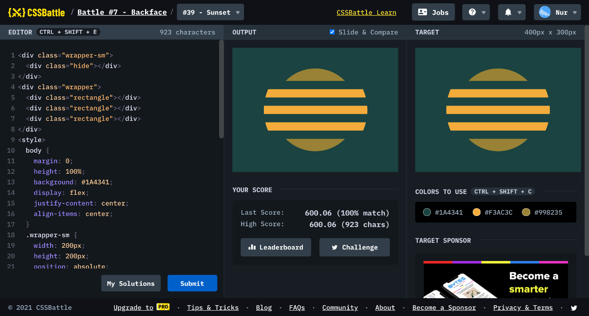

# Battle #7 - Backface

## #39 - Sunset

[Link to the problem](https://cssbattle.dev/play/39)



```html
<div class="wrapper-sm">
  <div class="hide"></div>
</div>
<div class="wrapper">
  <div class="rectangle"></div>
  <div class="rectangle"></div>
  <div class="rectangle"></div>
</div>
<style>
  body {
    margin: 0;
    height: 100%;
    background: #1A4341;
    display: flex;
    justify-content: center;
    align-items: center;
  }
  .wrapper-sm {
    width: 200px;
    height: 200px;
    position: absolute;
    background: #998235;
    border-radius: 50%;
  }
  .hide {
    height: 140px;
    width: 100%;
    background: #1A4341;
    margin-top: 30px;
  }
  .wrapper {
    z-index: 2;
    width: 250px;
    height: 250px;
    box-sizing: border-box;
    border-radius: 50%;
    overflow: hidden;
    display: flex;
    flex-direction: column;
    align-items: center;
    justify-content: space-between;
    padding: 75px 0;
  }
  .rectangle {
    height: 20px;
    width: 100%;
    background: #F3AC3C;
  }
</style>
```