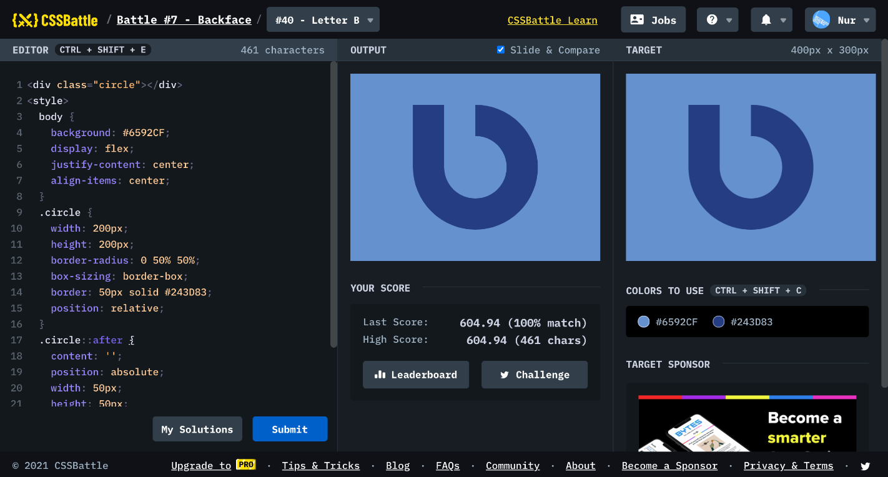

# Battle #7 - Backface

## #40 - Letter B

[Link to the problem](https://cssbattle.dev/play/40)



```html
<div class="circle"></div>
<style>
  body {
    background: #6592CF;
    display: flex;
    justify-content: center;
    align-items: center;
  }
  .circle {
    width: 200px;
    height: 200px;
    border-radius: 0 50% 50%;
    box-sizing: border-box;
    border: 50px solid #243D83;
    position: relative;
  }
  .circle::after {
    content: '';
    position: absolute;
    width: 50px;
    height: 50px;
    background: #6592CF;
    top: -50px;
  }
</style>
```