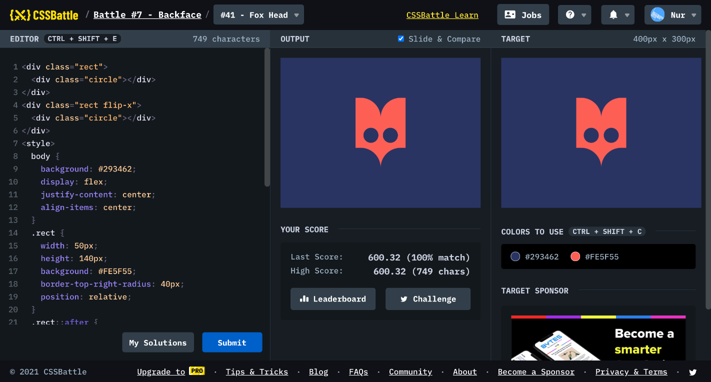

# Battle #7 - Backface

## #41 - Fox Head

[Link to the problem](https://cssbattle.dev/play/41)



```html
<div class="rect">
  <div class="circle"></div>
</div>
<div class="rect flip-x">
  <div class="circle"></div>
</div>
<style>
  body {
    background: #293462;
    display: flex;
    justify-content: center;
    align-items: center;
  }
  .rect {
    width: 50px;
    height: 140px;
    background: #FE5F55;
    border-top-right-radius: 40px;
    position: relative;
  }
  .rect::after {
    content: '';
    position: absolute;
    width: 50px;
    height: 100px;
    background: #293462;
    border-top-right-radius: 40px;
    top: 100px
  }
  .circle {
    position: absolute;
    width: 30px;
    height: 30px;
    background: #293462;
    border-radius: 50%;
    right: 5px;
    top: 60px;
  }
  .flip-x {
    transform: scaleX(-1);
  }
</style>
```