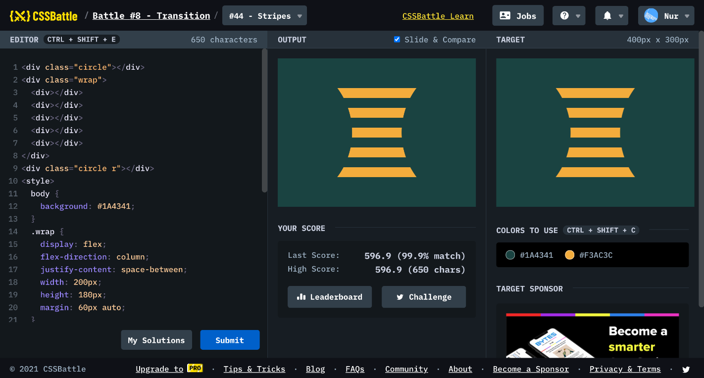

# Battle #8 - Transition

## #44 - Stripes

[Link to the problem](https://cssbattle.dev/play/44)



```html
<div class="circle"></div>
<div class="wrap">
  <div></div>
  <div></div>
  <div></div>
  <div></div>
  <div></div>
</div>
<div class="circle r"></div>
<style>
  body {
    background: #1A4341;
  }
  .wrap {
    display: flex;
    flex-direction: column;
    justify-content: space-between;
    width: 200px;
    height: 180px;
    margin: 60px auto;
  }
  .wrap div {
    width: 100%;
    height: 20px;
    background: #F3AC3C;
  }
  .circle {
    position: absolute;
    width: 300px;
    height: 300px;
    background: #1A4341;
    border-radius: 50%;
    left: -150px;
    top: 0;
  }
  .circle.r {
    left: auto;
    right: -150px;
  }
</style>
```