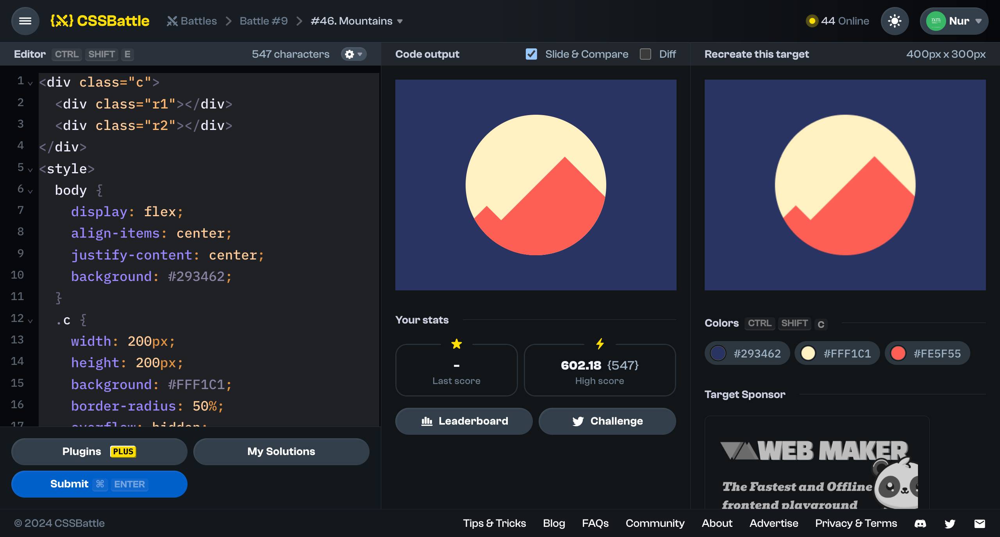

# Battle #9 - Margin

## #46 - Mountains

[Link to the problem](https://cssbattle.dev/play/46)



```html
<div class="c">
  <div class="r1"></div>
  <div class="r2"></div>
</div>
<style>
  body {
    display: flex;
    align-items: center;
    justify-content: center;
    background: #293462;
  }
  .c {
    width: 200px;
    height: 200px;
    background: #FFF1C1;
    border-radius: 50%;
    overflow: hidden;
  }
  .r1, .r2 {
    background: #FE5F55;
    width: 200px;
    height: 200px;
    transform: rotate(45deg);
  }
  .r1 { 
    margin-top: 101px;
    margin-left: 41px;
  }
  .r2 {
    margin-top: -130px;
    margin-left: -70px;
  }
</style>
```